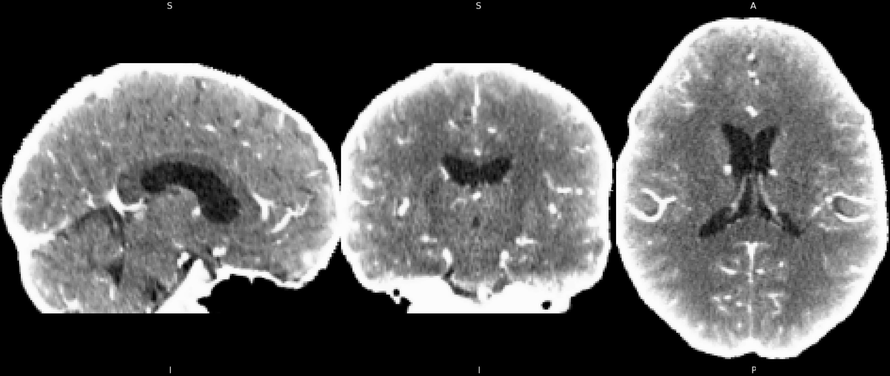

<script type="text/javascript" src="header.js"></script>


# Imaging data

All CTA images were first converted from DICOM to Nifti format, skull stripped, resampled, and finally linearly registered to a common image template with a rigid transformation. All images have a 146x182x133 resolution and a 1x1x1mm voxel size. Voxel values were clipped to a range from 0 to 100 Hounsfield Units. Images with small registration errors have been included.

LVO labels are manually extracted from the stroke centers' neuroradiologist reports. An LVO will be defined as an occlusion in the ICA, M1, M2, or A1 brain vasculature. High-grade stenosis or near-complete occlusions will not be considered LVOs. Posterior circulation stroke and LVO in other segments are excluded. The class distribution for this classification task is not chosen according to the real-world distribution that a primary care hospital might see, as otherwise, we would have to include order of magnitude more controls.



# Clinical Data

For Task 2 participants are encouraged to use  clinical variables that may be relevant to the prediction of a successful reperfusion. A successful reperfusion is defined as one achiving a mTICI score equal or greater than 2c during the first pass. More information about the choice of this threshold and mTICI score can be found at this paper:
```
Yoo, A. J. et al. Benchmarking the Extent and Speed of Reperfusion: First Pass TICI 2c-3 Is a Preferred Endovascular Reperfusion Endpoint. Front. Neurol. 12, 669934 (2021).
```

The following clinical variables have been included:
- Patient age \[age\]
- Patient sex \[gender\]
- Large vessel occlusion site \[cta_occlusion_site\]
- Patient received tissue plasminogen activators (tPA) \[tpa\]
- Minutes from last known well (i.e. estimated stroke event) to CTA imaging \[lkw2ct\] 
- \[baseline_nihss\]

the column names used in the CSV file are indicated between brackets \[\] .

## Data Dictionary

Variable | Values 
---|---
Age | integer (years)
Sex | 1: Male; 2: Female
Large vessel occlusion site | 1	Intracranial ICA; 2	A1; 3	A2; 4	M1; 5	M2; 6	PCA; 7	Basilar artery; 8	Intracranial Vertebral Artery; 9	Other; 10	None (not all are used in this challenge)
tPA | 1: Yes; 0: No
Minutes from last known well | integer (minutes)
Baseline NIH stroke scale | integer from 0 to 42

not all patients have all variables. These variables are included in a single CSV file for all subjects and challenge phases. 


# Data Download

The data is available for download at the submission and leaderboard page after team registration and activation. It will be divided into four password-protected zip files. Two for task 1 and task 2 at phase 1, which will be released immediately, and other two for phase 2, e.g. the final testing phase which will be released according to the schedule.

# Results Submission

The results should be submitted as CSV files with two columns, one for the subject ID and the other for the score generated by the participant algorithm indicating the likelihood of having LVO (task 1) and that the reperfusion will be successful (task 2). The following files are example of the format required for the first phase of task 1 and task 2:
- [Phase 1 Task 1](res/subm-example-task1-phase1-random.csv)
- [Phase 1 Task 2](res/subm-example-task2-phase1-random.csv)

The scores included have been randomly generated.
