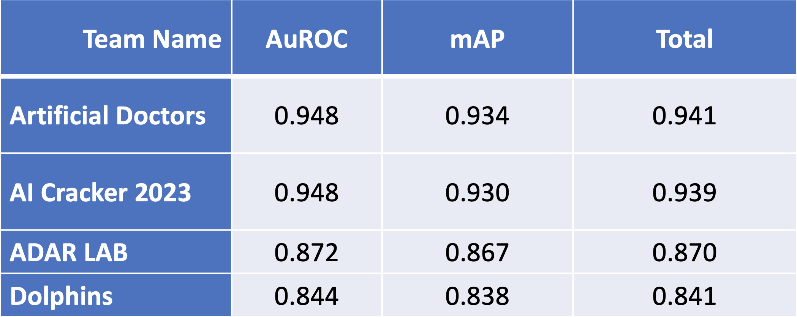
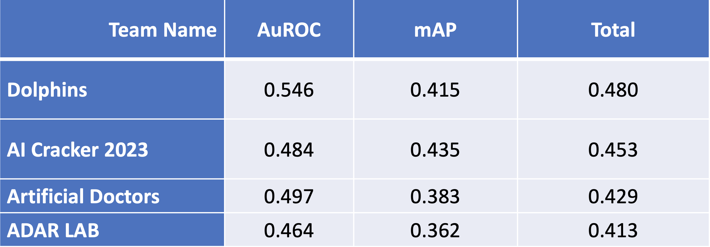

#  IACTA-EST 2023 Winning Teams

Congratulations to the two winning teams for the 2023 edition of the IACTA-EST Challenge!

**Artificial Doctors**

Michael Yeung 

Department of Computing, Imperial College London, London, UK; Lucida Medical Ltd, University of Cambridge Biomedical Innovation Hub, Cambridge, UK
 

**AI Cracker 2023**

Yanbo J. Wang, Sheng Chen, Hui Qin, Zhe Sun, Na Zhang, Min Yuan, Xuan Yang

LYZD-FinTech Co., LTD , Beijing, China

Qu Liu, Yan Li

The First Medical Center, Chinese PLA General Hospital, Beijing, China

#  2023 Leaderboard
## Task 1: LVO Detection

As a reference, here are the scores of a bootstrapped random classifier 95% confidence intervals:
- Area under the ROC curve (AuROC): 0.38-0.62 
- Average Precision Score (mAp): 0.41-0.61 
- Total score (AuROC and mAp average): 0.41-0.61

Artificial Doctors and AI Cracker 2023 teams reached essentially equivalent predictive performance, and they were well above the random classifier confidence intervals.

## Task 2: Reperfusion Prediction

As a reference, here are the scores of a bootstrapped random classifier 95% confidence intervals:
- Area under the ROC curve (AuROC): 0.27-0.73 
- Average Precision Score (mAp): 0.27-0.66 
- Total score (AuROC and mAp average): 0.27-0.73

No team was above the random classifier confidence intervals. Therefore, all teams have equally low predictive performance